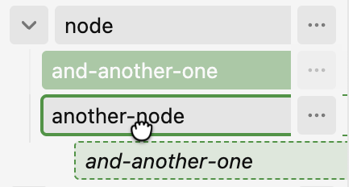
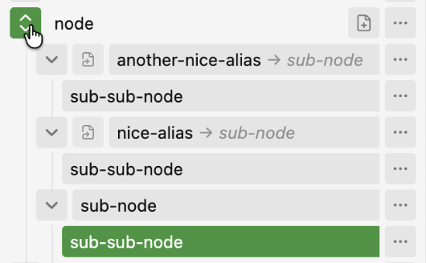
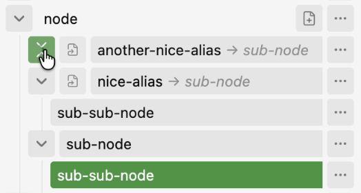
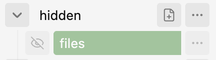
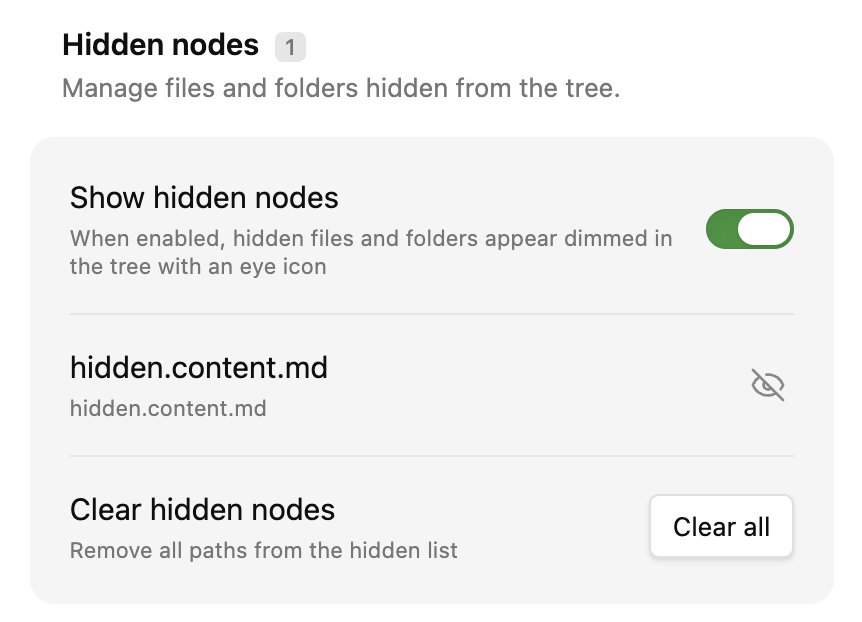
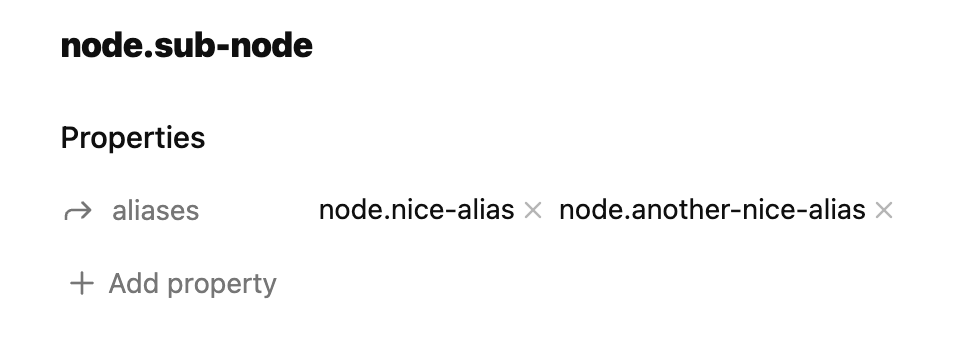
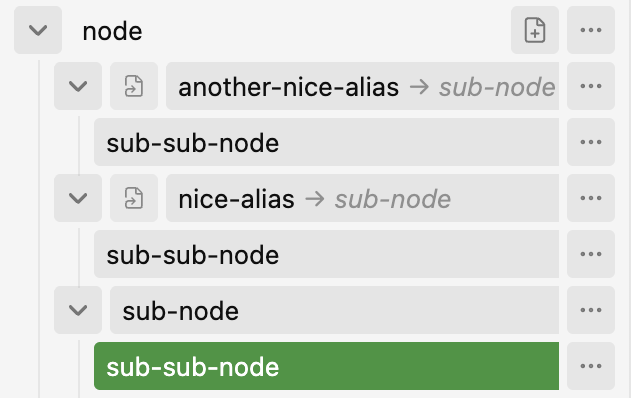

# Dot Navigator


A hierarchical note management system with Dendron-like features.

This tool brings hierarchical note management capabilities to your vault, inspired by Dendron. It allows you to organize your notes in a tree-like structure, making it easier to navigate and manage large knowledge bases.

(While Dot Navigator maintains some compatibility with Dendron-structured notes, future compatibility is not guaranteed. It is primarily intended for use with notes in your vault, utilizing a Dendron-like structure)

## Installation

Until the plugin is officially released, you can install it through BRAT (Beta Review and Testing)
1. <a href="https://jeansordes.github.io/redirect?to=obsidian://show-plugin?id=obsidian42-brat" target="_blank">Install the BRAT plugin</a> if you don't have it already
2. <a href="https://jeansordes.github.io/redirect?to=obsidian://brat?plugin=jeansordes/dot-navigator" target="_blank">Install Dot Navigator using BRAT</a>

## Features

- **Hierarchical note organization** with a tree-like interface
- **Instant loading with IndexedDB caching**, the tree view loads instantly even for large vaults by caching the tree structure
- **Performance optimized for very large vaults**, meaning you can expand all 10K notes from your vault at once on your phone, it will still run and scroll smoothly 👌
- **Designed and optimized for mobile before desktop** with lazy loading of suggestions for better mobile performance
- **Rule-based suggestions** with an in-app rules editor in settings — define patterns and children, preview matches, reorder rules, and import/export JSON so you can scaffold structures before the notes exist


- **Hierarchical suggestions from dotted children** - when a rule specifies children like `["foo.bar"]`, it creates nested suggestion nodes where "foo" contains "bar" as a child, allowing for deeper scaffolding of note hierarchies
- **Double-click to create notes from suggestions** - quickly create suggested notes by double-clicking on them in the tree view

- **Persistent expanded state across sessions** (the tree view will remember which nodes are expanded or collapsed when you close/reopen the app)
- **Horizontal scrolling** support for deeply nested structures (you can write very long path notes and scroll horizontally to see the full path of the note)
- **Drag-and-drop to move files, folders, and virtual nodes** directly in the tree (children are moved/renamed along with their parent). Press **Escape** while dragging to cancel.



- **Expand or collapse all descendants at once** by double-clicking a node's chevron, or via the context menu




- **CMD/Ctrl+click to open a file in a new tab**
- **Hide files and folders from the tree** - hide any node from the context menu to declutter your tree. A header toggle lets you reveal hidden nodes (shown dimmed, with a crossed-eye icon that turns into an open eye on hover to reveal them again), and they can be managed or cleared from the settings.





- **Redirect shortcut stubs** - create `.md` stub files with `redirect` frontmatter to place a note at alternate locations in the tree. Shift+drag (or Alt+Cmd/Ctrl+drag) onto another node to create a stub; drag the stub row to move it; delete stubs from the context menu without deleting the target note. Title click opens the redirect target; use the symlink icon to open the stub file.

```yaml
---
redirect: notes/target.md
---
```




- **UI for renaming a note and its children** with a nice UI


- **Undo the last rename operation** that was done in the rename dialog of the plugin (through the UI, with **Cmd/Ctrl+Z** when undo is available, or with a command dedicated for that). The dialog auto-closes when the rename finishes and restores undo state when reopened.


- **Customizable context menus** (click the "…" button or do a right click on a file or folder) - add your own commands and **drag to reorder** menu items


- **Easy access to global commands in UI**


- **Support for all file types** with appropriate icons and extensions


- **Theme-aware styling** with proper dark mode support


- **Child count badges** — optionally show direct children, total descendants, or both on tree rows (configurable in settings under **Tree display**)

- **YAML title support** - displays custom titles from frontmatter instead of filenames (e.g. `prj.md` with the property `title = "Projects"` will be displayed as `Projects` in the tree view)


- **Internationalization support**, based on the language set in the settings, defaulting to English. (As of now, only English and French 🇫🇷 are supported, you can request a new language by creating an issue)

## Rule Configuration

Dot Navigator supports **rule-based suggestions** that automatically suggest virtual child notes for existing files. This allows you to scaffold note hierarchies before the actual notes exist.

### Setting Up Rules

1. Open **Dot Navigator settings** in Obsidian
2. Go to the **Note suggestion schema** section
3. **Add rules** with the in-app editor, or **Import JSON** to load an existing configuration

Each rule is edited as a card with pattern, exclude, and children fields. You can preview which notes match a pattern, drag to reorder rules, and use **View JSON** to copy or back up your configuration.

If you previously used a `dot-navigator-rules.json` file in your vault, rules are migrated automatically into plugin settings on first load after upgrading.

### Rule Syntax

Each rule object can have these properties:

- **`pattern`** (required): String or array of strings defining which files to match
- **`exclude`** (optional): String or array of strings defining files to exclude from matching
- **`children`** (required): Array of strings defining suggested child note names

### Pattern Syntax

Dot Navigator uses enhanced glob patterns with special wildcards:

- **`*`** matches any sequence of characters **within a single path segment** (stops at dots)
- **`**`** matches any sequence of characters **across multiple path segments** (matches dots)

For more complex pattern matching, you can use **regex patterns** by prefixing with `/`.

### Examples

```json
[
  {
    "pattern": ["prj.*"],
    "children": ["roadmap", "ideas", "issues", "architecture.backend", "architecture.frontend"]
  },
  {
    "pattern": ["work.**"],
    "exclude": ["work.archives"],
    "children": ["notes", "tasks"]
  },
  {
    "pattern": ["/^blog\\.2025\\.[0-9]$/"],
    "children": ["draft", "published"]
  }
]
```

**What this does:**
- Files matching `prj.*` (like `prj.frontend`, `prj.backend`) will suggest children `roadmap`, `ideas`, `issues`, and hierarchical children `architecture.backend` and `architecture.frontend`
- Files matching `work.**` (like `work.tasks`, `work.2024.tasks`, `work.deep.nested`) will suggest `notes`, `tasks` (except `work.archives`)
- Files matching `/^blog\.2025\.[0-9]$/` (regex for single-digit months) will suggest `draft`, `published`

**Hierarchical Children:**
For dotted children like `"architecture.backend"`, the plugin creates nested suggestion nodes. In the tree view, you'll see:
- `architecture/` (intermediate folder-like node)
  - `backend` (clickable suggestion that creates `backend.md`)

You can create deeply nested hierarchies by using multiple dots, such as `"a.b.c.d"`.

### Importing and Exporting Rules

- **View JSON** — copy your current rules as a JSON array for backup or sharing
- **Import JSON** — paste a JSON array of rules to add them to your existing configuration (unknown fields are preserved)

Rules are stored in plugin settings and reload immediately when you save changes in the editor.

## Available Commands

Dot Navigator provides several commands that can be accessed via the Command Palette (Ctrl/Cmd+P):

### Core Navigation
- **Open Tree View**: Opens the Dot Navigator View in the left sidebar
- **Show File in Tree View**: Highlights and reveals the current file in the tree view
- **Collapse All Nodes in Tree**: Collapses all nodes in the tree view
- **Expand All Nodes in Tree**: Expands all nodes in the tree view
- **Toggle show hidden nodes**: Shows or hides nodes that have been hidden from the tree
- **Open Closest Parent Note**: Opens the nearest existing parent note of the current file (checks dotted parents like `a.b.c` → `a.b` → `a`)

### Note creation
- **Create Child Note**: Creates a new child note for the currently active file with the node name being "untitled" (e.g. if you trigger this command on `a.md`, it will create `a.untitled.md`). Use **Rename Current File** or the tree context menu to rename it afterward (you can customize the default name in settings)

### Suggestion Interaction
- **Double-click suggestions**: Quickly create suggested notes by double-clicking on them in the tree view
- **Single-click suggestions**: Focus/navigate to the suggestion in the tree

### Rename
- **Rename Current File**: Opens the rename dialog for the current file or folder
- **Undo Last Rename Operation**: Reverses the most recent rename operation

## Acknowledgments

- [Dendron](https://www.dendron.so/) for the inspiration on hierarchical note management

### Other tools that inspired this one:
- [Structured Tree](https://github.com/Rudtrack/structured-tree)
- [Obsidian Structure](https://github.com/dobrovolsky/obsidian-structure)
- [Obsidian Dendron Tree](https://github.com/levirs565/obsidian-dendron-tree)
